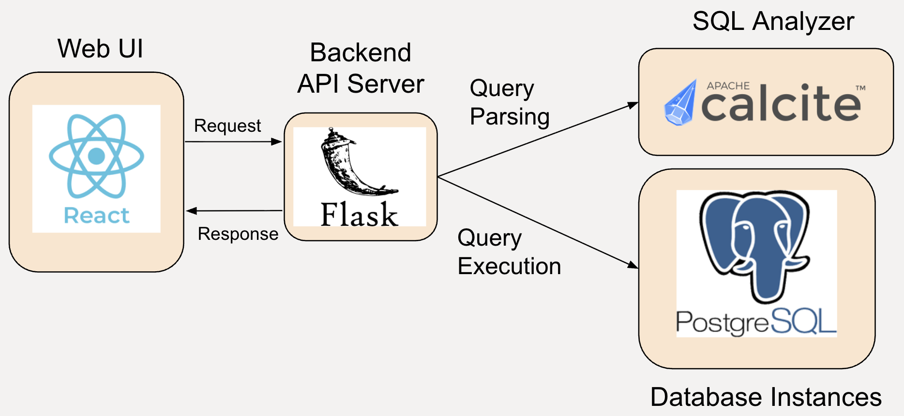

# i-Rex

This is the alpha release of I-Rex, an interactive SQL debugger. 

## Architecture

The I-Rex architecture is shown above. It contains a [frontend](./frontend/) that lays out the debugging interface for users in a web browser, and a [backend Flask API server](./backend) that relays any request/response. The [SQL Analyzer](./sqlanalyzer/) is responsible for parsing the query to be debugged and automatically generate all rewritten queries for quickly retrieving data for debugging. This information is then sent to and cached in the client-side browser. When data is needed for debugging, the client would send the relevant rewritten query to the API server, which calls the databases and forward the execution results back to the client. The current version of I-Rex only support [PostgreSQL](https://www.postgresql.org/). More RDBMS will be supported in the future.

## Deployment
I-Rex is packaged using [Docker](https://www.docker.com/) for easy deployment. Before proceeding, make sure Docker is properly installed. It is recommended that you add [Docker to your sudo group](https://docs.docker.com/engine/install/linux-postinstall/) to avoid typing `sudo` for all Docker commands. Before deploying, follow one of the pre-deployement steps depending on your requirement.

### Pre-Deployment Steps (use provided database instances)
1. The [hnrq-db](./hnrq-db/) provides 4 toy database instances ---  2 of them are under beers schema and 2 of them are under TPC-H schema. To deploy the toy databases, run the following command under project root (make sure port 5432 on localhost is not occupied):
```
docker compose up -d --build postgres
```
2. Once succeed, go into the container to install necessary user-defined functions (UDFs). The following command will give you an interactive shell from the container:
```
docker compose exec -u hnrq -it postgres bash --login
```
3. Once in the shell, run `cd ~/shared/`, and run the following commands to build and install the UDFs:
```
bash install.sh
```

### Pre-Deployment Steps (use own database instances)
Go into the [UDF Directory](./hnrq-db/sargsum/), and follow the [instruction](./hnrq-db/sargsum/README.md) to install all UDFs in **ALL** databases that you would like to use I-Rex for. Then look into the [environment file](./.env), and change `DB_USER` and `DB_PASSWORD` to your credential. Also modify the `DB_PORT` if your Postgres is not running on port 5432.

### Deployment
1. We start by building the frontend artifacts. Make sure you have [npm](https://docs.npmjs.com/downloading-and-installing-node-js-and-npm). Under `./frontend`, run `npm install` followed by `npm run build`. 

2. We now build the SQL Analyzer. Make sure you have [mvn](https://maven.apache.org/). Under `./sqlanalyzer`, run `mvn package`. Then move or copy the artifact `sqlanalyzer-1.0-jar-with-dependencies.jar` to `./backend` and rename it to `sqlanalyzer.jar`. Alternatively, you can download a copy of the .jar file [here](https://users.cs.duke.edu/~yh218/uploads/sqlanalyzer.jar).

3. Now we are ready to fire up the backend, run `docker compose up -d --build backend` under project root.

4. Once the backend is running, set up `Nginx` by running `docker compose up -d --build nginx`.

5. Now you can access I-Rex at `localhost:80`.

## Evaluation
To reproduce the experiment results in the I-Rex research paper. Please go to the [Evaluation](./evaluation/) directory and follow the instructions in the corresponding [README](./evaluation/README).
